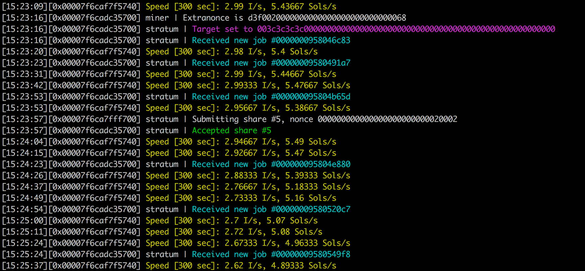

## Super-easy Zcash/ZCoin (ZEC) mining and Bitcoin (BTC) payout

This 3-step mining workflow works on any operating system (Windows, Mac OS X, Linux). 
It enables you to mine ZEC using your CPU and Equihash based hashing. 
It comes with CPU_XENONCAT support for maximum performance.

The ZEC you will generate are paid-out in Bitcoin (BTC) by NiceHash.com.

Prerequisites:
- Download the `Dockerfile` and copy it into a directory
- Install docker from [docker.com](https://www.docker.com)

### 1. Create container

Change to the directory where the `Dockerfile` resides. 

Open a terminal and run:

    docker build -t miner .

Wait until the docker image is ready.

### 2. Run container

Open a terminal and run:

    docker run miner -u YOUR_BITCOIN_ADDRESS
    
e.g.

    docker run miner -u 114zzfekar5q1RDEQ5LZDzqurLDmmeSMVQ

Add `-d` for deamon mode (running in background).

Change `-u` to your BTC address.

You don't have a Bitcoin Wallet address? Visit [coinbase.com](https://coinbase.com)

### 3. Make money!

See how your money generation goes:

[https://www.nicehash.com/?p=miners&addr=YOUR_BITCOIN_ADDRESS](https://www.nicehash.com/?p=miners&addr=114zzfekar5q1RDEQ5LZDzqurLDmmeSMVQ)

### 4. Donate me a coffee ;)

Do you like generating money using this code?

Donate me a coffee by sending BTC to: `114zzfekar5q1RDEQ5LZDzqurLDmmeSMVQ` 

